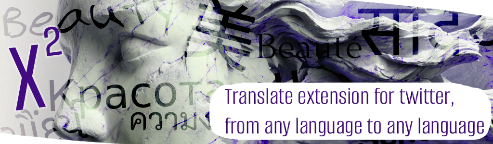
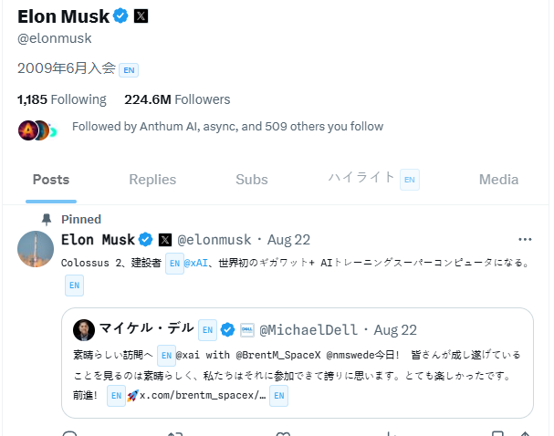
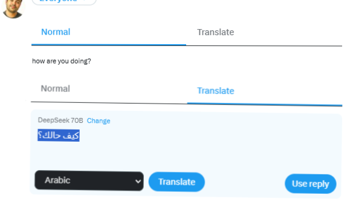
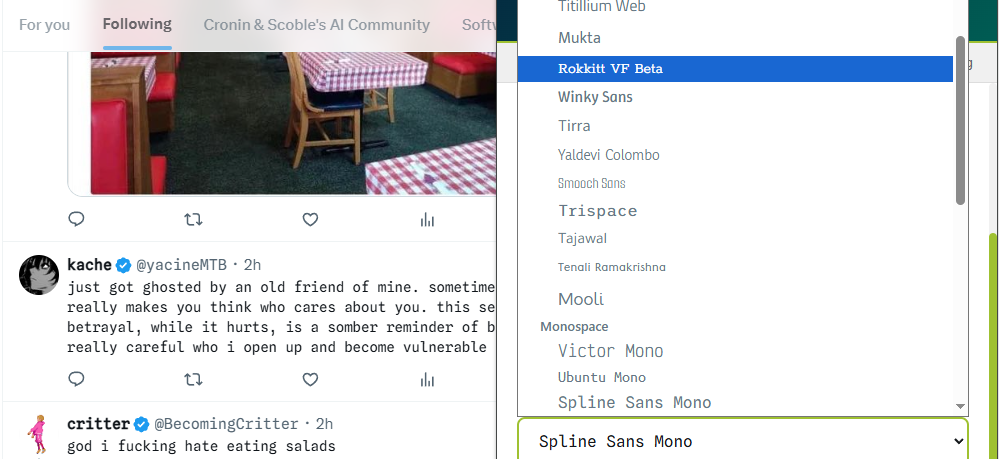
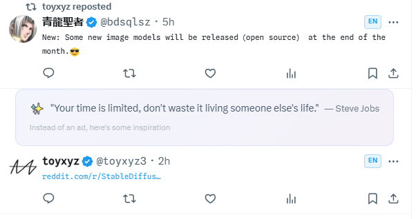
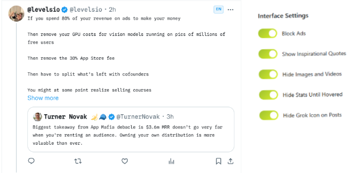
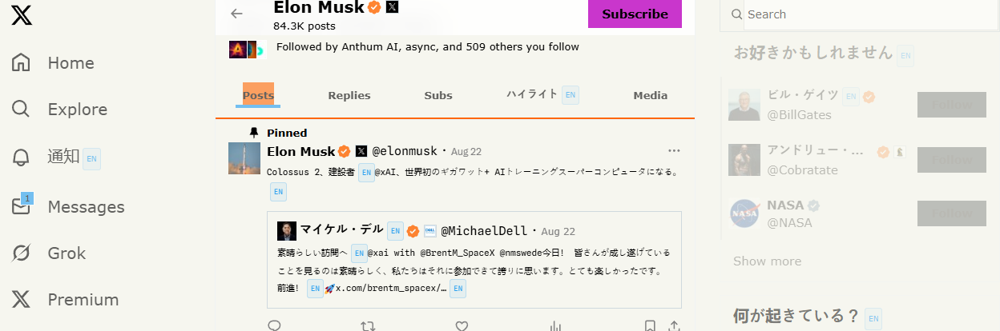
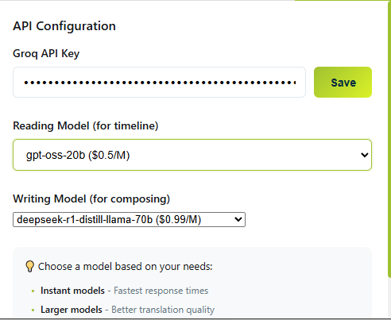
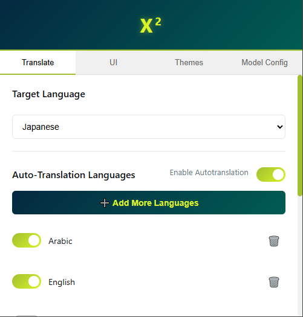

# X² 

<p align="center">
  
</p>

---

## ✨ Features

### 🌍 Multi-Language Translation
Automatic translate to the langauge you want to read in. 

Eg: <br/>
English, Arabic --> Japaneese <br/>
Japaneese, German --> English

- Pick your target language that you want to read in
- Pick languages that you want translations to happen automatically for




### 🌍 Reply in any language
With a new tab when writing or replying to tweets, translate your tweet or replies to any language




### 📝 Change Fonts
Pick from 50 different fonts




### 🚫 Ad Blocking
Replace promoted tweets with beautiful, inspirational quotes. Instead of ads, get motivated!




### 🎯 Focus Mode
- Hide images and videos from the feed and only show them on hover
- Hide likes comments and view counts till you hover on the tweets
- Hide the Grok logo from the interface




### 🎨 Custom Themes
Keep the base original theme or switch it out to something radical like a HackerNews theme [experimental] (for now its in the 'its an aquired taste' cope phase)



**Available Themes:**
- **Original** - Default Twitter/X theme
- **Midnight Dream** - Deep blue/purple night theme for late-night browsing
- **Forest Zen** - Calming green nature theme for reduced eye strain
- **Green Globe** - Environmental teal and lime theme
- **Hacker News** - Classic orange and beige theme


### 🤖 No middle man, you and your LLM provider
Its just you and your LLM inference provider - for now Groq is the only inference provider supported - your translation calls go from your browser to groq

- Pick different models for reading tweets (cheaper, faster)
 and writing tweets (more accurate one)
 - Price given is per million tokens (its only idicative and was set when the app was written -- you can check their prices on their interface)





## 📦 Installation

### From Chrome Web Store
*Coming soon!*

### Manual Installation (Developer Mode)

1. **Download the Extension**
   ```bash
   git clone https://github.com/yourusername/x2-extension.git
   cd x2-extension
   ```

2. **Open Chrome Extensions Page**
   - Navigate to `chrome://extensions/`
   - Enable "Developer mode" (top right toggle)

3. **Load the Extension**
   - Click "Load unpacked"
   - Select the extension directory
   - The extension icon will appear in your toolbar


## 🚀 Setup

### Step 1: Get a Groq API Key (for translation features)

1. Visit [Groq Console](https://console.groq.com)
2. Sign up for a free account
3. Navigate to API Keys section
4. Create a new API key
5. Copy the key (starts with `gsk_`)

### Step 2: Configure the Extension

1. Click the X² extension icon in your toolbar
2. Go to the "Model Config" tab
3. Paste your Groq API key
4. Click "Save"


### Step 3: Select Your Preferences

1. **Choose Languages** (Translation tab)
   - Toggle languages you want to translate
   - Add custom languages from 100+ options
   
2. **Select Theme** (Themes tab)
   - Preview and select your preferred theme
   
3. **Configure Features** (Features tab)
   - Toggle ad blocking, media hiding, etc.
   - Adjust font size and style

## 📖 Usage

### Translation Feature



1. **Automatic Detection**: Foreign language tweets are automatically detected
2. **Language Badge**: A small badge appears showing the detected language
3. **Toggle Translation**: Click the badge to translate/untranslate
4. **Batch Processing**: Multiple tweets translate simultaneously for efficiency

### Managing Themes

Simply select a theme from the dropdown - changes apply instantly!

### Font Customization

1. Navigate to Features tab
2. Toggle "Use Custom Font"
3. Select from 50+ fonts
4. Adjust size with slider (10-18px)

## 🛠️ Development

### Project Structure

```
x2-extension/
├── manifest.json          # Extension configuration
├── content.js            # Main content script (runs on Twitter/X)
├── popup.html/js/css     # Extension popup interface
├── config.js             # Configuration constants
├── quotes.js             # Inspirational quotes database
├── languages.js          # Language definitions
├── themes.css            # Theme stylesheets
├── styles.css            # Feature styles
├── fonts/                # Custom font files (50+ fonts)
├── fontLoader.js         # Font injection system
└── popupFontLoader.js    # Popup font loader
```

### Key Files Explained

#### `manifest.json`
Chrome extension manifest defining permissions, content scripts, and resources.

#### `content.js` (Main Logic)
- **Lines 1-68**: Font mapping configuration
- **Lines 70-136**: Ad detection and quote replacement
- **Lines 138-846**: Theme and UI feature management  
- **Lines 847-1007**: Translation system with Groq API
- **Lines 1008-1900**: Tweet processing and language detection

#### `popup.js` (Settings Interface)
- **Lines 1-200**: State management and Chrome storage
- **Lines 201-400**: Theme and feature toggles
- **Lines 401-500**: Font selection system
- **Lines 501-700**: Language management
- **Lines 701-900**: Model configuration

### Adding New Features

#### Adding a New Model

1. Edit `popup.html` to add the model to the dropdown:
```html
<option value="new-model-id">New Model Name</option>
```

2. Add pricing info in the model description section

#### Adding a New Font

1. Add the font file to `/fonts` directory
2. Update `fontLoader.js`:
```javascript
const fontDefinitions = [
  // ... existing fonts
  { family: 'Your Font Name', file: 'YourFont.ttf' }
];
```

3. Update `content.js` font map:
```javascript
const FONT_MAP = {
  // ... existing mappings
  "uniqueid123": "Your Font Name"
};
```

4. Add to `popupFontLoader.js` for popup preview

#### Adding a New Language

1. Edit `languages.js`:
```javascript
const DEFAULT_LANGUAGES = {
  // ... existing languages
  'es': 'Spanish',
  'fr': 'French'
};
```

2. The extension automatically handles Unicode detection for the new language

#### Creating a New Theme

1. Add theme styles to `themes.css`:
```css
/* Your Theme Name */
body[data-theme="yourtheme"] {
  --bg-color: #hexvalue;
  --text-primary: #hexvalue;
  --text-secondary: #hexvalue;
  --border-color: #hexvalue;
  --hover-bg: #hexvalue;
}

/* Tweet styling */
body[data-theme="yourtheme"] article[data-testid="tweet"] {
  background: var(--bg-color);
  color: var(--text-primary);
}
```

2. Add theme option to `popup.html`:
```html
<option value="yourtheme">Your Theme Name</option>
```

3. Add preview gradient in `popup.css`:
```css
option[value="yourtheme"] {
  background: linear-gradient(90deg, color1, color2);
}
```

### API Integration

The extension uses Groq API for translations. To modify the API behavior:

1. **API Endpoint**: Line 957 in `content.js`
2. **Model Selection**: Lines 970-975 in `content.js`
3. **Rate Limiting**: Implement in `processTranslations()` function
4. **Error Handling**: Lines 978-1006 in `content.js`

### Building for Production

1. **Minify JavaScript files** (optional):
```bash
# Install terser
npm install -g terser

# Minify files
terser content.js -o content.min.js
terser popup.js -o popup.min.js
```

2. **Update manifest.json** to use minified files

3. **Create release package**:
```bash
# Create a zip file excluding development files
zip -r x2-extension.zip . -x "*.git*" "*.md" "screenshots/*" "samplePages/*"
```

## 🤝 Contributing

We welcome contributions! Here's how you can help:

### Reporting Issues
- Check existing issues first
- Include browser version and error messages
- Provide steps to reproduce

### Submitting Pull Requests

1. Fork the repository
2. Create a feature branch:
```bash
git checkout -b feature/your-feature-name
```

3. Make your changes following the code style:
   - Use safe DOM methods (no innerHTML)
   - Add error handling for API calls
   - Comment complex logic
   - Test on Twitter/X

4. Commit with clear messages:
```bash
git commit -m "Add: New feature description"
```

5. Push and create a Pull Request

### Code Style Guidelines

- **Security First**: No innerHTML, eval, or unsafe practices
- **Error Handling**: Catch and handle all API failures gracefully  
- **Performance**: Batch operations when possible
- **User Privacy**: Never log sensitive user data
- **Accessibility**: Maintain keyboard navigation support

## 📄 License

MIT License - see [LICENSE](LICENSE) file for details

## 🙏 Acknowledgments

- Google Fonts for the extensive font library
- The open-source community for inspiration

## 📞 Support

- **Issues**: [GitHub Issues](https://github.com/dminGod/x2/issues)

---

<p align="center">
  Made with ❤️ for a better Twitter/X experience
</p>

<p align="center">
  <a href="https://github.com/yourusername/x2">⭐ Star on GitHub</a>
</p>
